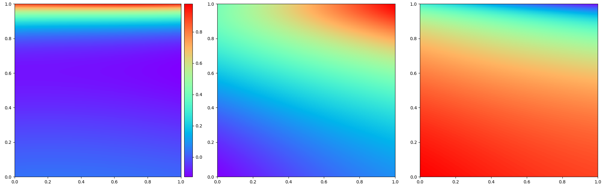

# ldc_pinn

wip...will update later

## Current best performing model yields the following:

x velocity, y velocity and pressure from left to right

## Literature:

Raissi's paper on PINN : https://arxiv.org/pdf/1711.10561.pdf

Coupled-Automatic-Numerical Differentiation Method for PINN : https://arxiv.org/ftp/arxiv/papers/2110/2110.15832.pdf

https://deepai.org/publication/can-pinn-a-fast-physics-informed-neural-network-based-on-coupled-automatic-numerical-differentiation-method

## Benchmark data:

http://www.zetacomp.com/benchmarks/lid-driven-cavity-2d.asp

https://www.acenumerics.com/the-benchmarks.html